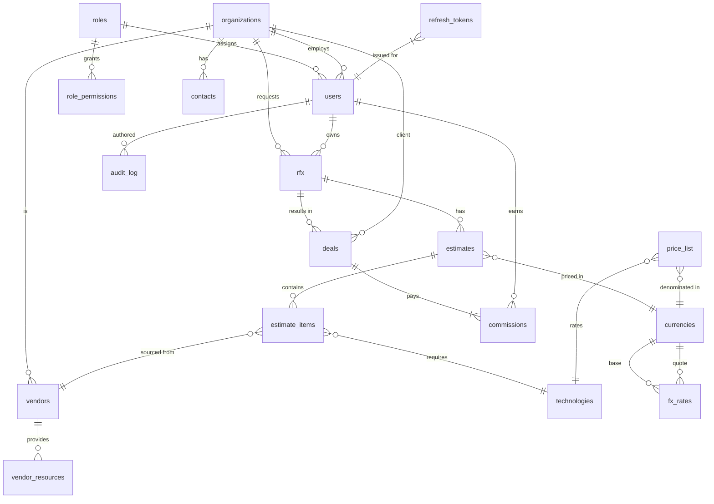

# DealFlow Database Schema

## Entity Relationship Diagram

## Design Notes

- **Soft Deletes:** User-facing entities (`organizations`, `contacts`, `rfx`, `estimates`, `estimate_items`, `vendors`, `vendor_resources`, `deals`) include a `deleted_at` timestamp. n8n workflows will filter out records with a non-null `deleted_at` to preserve history without losing relational integrity.
- **Audit Logging:** `audit_log` captures every mutation along with optional `delta_json`, IP, and user agent. Foreign keys use `ON DELETE SET NULL` to retain provenance even if the actor account is removed.
- **Prepared-Statement Friendly Schema:** All foreign keys align with required RBAC filters, ensuring n8n MySQL nodes can parameterize queries without string interpolation.
- **RBAC Seeds:** `roles` and `role_permissions` seed statements mirror the approved permission matrix so the application can resolve permissions immediately after migration. Admin retains the wildcard `*` to simplify authorization checks.
- **Currency & FX Handling:** Rates, estimates, deals, and price lists reference the `currencies` table. `fx_rates` enforces uniqueness per `base/quote/as_of` so daily cron jobs can upsert rates safely while keeping history for audit.
- **Token Hygiene:** `refresh_tokens` and `token_blacklist` tables support rotating refresh tokens and server-side invalidation without storing raw tokens (only SHA-256 hashes), aligning with the authentication requirements.
- **Data Integrity:** All `_id` fields enforce `ON DELETE RESTRICT` (except where cascading nulls are necessary) to prevent orphan records, preserving historical associations for compliance and reporting.

## RBAC Seeding Confirmation

The migration seeds `roles` for Admin, Sales, Ops, Finance, and Vendor_Manager. Each role receives permissions as defined in the approved matrix, ensuring `estimate.view_cost`, `estimate.view_margin`, and vendor cost access are limited to the correct personas from day one.

